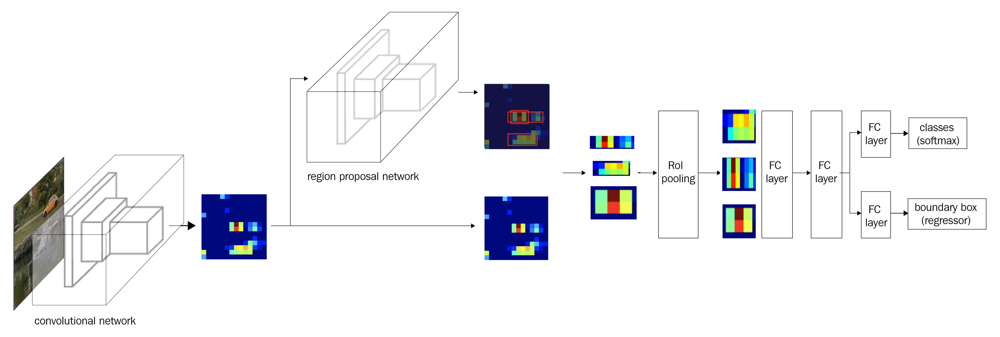
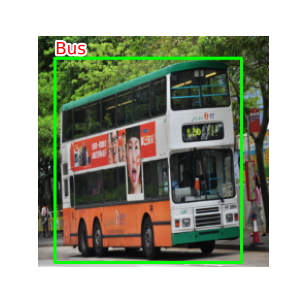
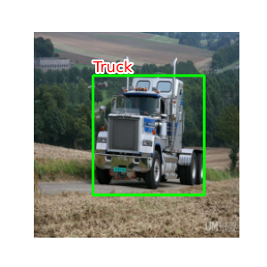

# Fast R-CNN implement on pytorch

## 数据框架概览

- **ImageID**: 图像的唯一标识符。
- **Source**: 数据来源。
- **LabelName**: 标注的目标类别。
- **Confidence**: 标注的置信度。
- **XMin, XMax, YMin, YMax**: 目标在图像中的边界框坐标。
- **IsOccluded, IsTruncated, IsGroupOf, IsDepiction, IsInside**: 目标的各种属性标记。
- **XClick1X, XClick2X, XClick3X, XClick4X, XClick1Y, XClick2Y, XClick3Y, XClick4Y**: 用户点击的坐标点。

---
    | ImageID             | Source | LabelName | Confidence  | XMin      | XMax      | YMin      | YMax      | IsOccluded | IsTruncated  | IsGroupOf | IsDepiction| IsInside  | XClick1X  | XClick2X  | XClick3X  | XClick4X  | XClick1Y  | XClick2Y  | XClick3Y  | XClick4Y  |
    |---------------------|--------|-----------|-------------|-----------|-----------|-----------|-----------|------------|--------------|-----------|------------|-----------|-----------|-----------|-----------|-----------|-----------|-----------|-----------|-----------|
    | 0000599864fd15b3    | xclick | Bus       | 1           | 0.343750  | 0.908750  | 0.156162  | 0.650047  | 1          | 0            | 0         | 0          | 0         | 0.421875  | 0.343750  | 0.795000  | 0.908750  | 0.156162  | 0.512700  | 0.650047  | 0.457197  |
    | 00006bdb1eb5cd74    | xclick | Truck     | 1           | 0.276667  | 0.697500  | 0.141604  | 0.437343  | 1          | 0            | 0         | 0          | 0         | 0.299167  | 0.276667  | 0.697500  | 0.659167  | 0.141604  | 0.241855  | 0.352130  | 0.437343  |
    | 00006bdb1eb5cd74    | xclick | Truck     | 1           | 0.702500  | 0.999167  | 0.204261  | 0.409774  | 1          | 1            | 0         | 0          | 0         | 0.849167  | 0.702500  | 0.906667  | 0.999167  | 0.204261  | 0.398496  | 0.409774  | 0.295739  |
    | 00010bf498b64bab    | xclick | Bus       | 1           | 0.156250  | 0.371250  | 0.269188  | 0.705228  | 0          | 0            | 0         | 0          | 0         | 0.274375  | 0.371250  | 0.311875  | 0.156250  | 0.269188  | 0.493882  | 0.705228  | 0.521691  |
    | 00013f14dd4e168f    | xclick | Bus       | 1           | 0.287500  | 0.999375  | 0.194184  | 0.999062  | 0          | 1            | 0         | 0          | 0         | 0.920000  | 0.999375  | 0.648750  | 0.287500  | 0.194184  | 0.303940  | 0.999062  | 0.523452  |
    |   ...               | ...    |...        |...          |...        |...        |...        |...        |...         |...           |...        |...         |...        |...        |...        |...        |...        |...        |...        |...        |...        |

***
## OpenDataset
 torch.unit.data.Dataset 的一个子类，获取训练所需数据
***
## 用 asset 文件夹下的demo*来做一个演示
"eval.py"

***